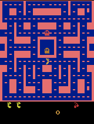
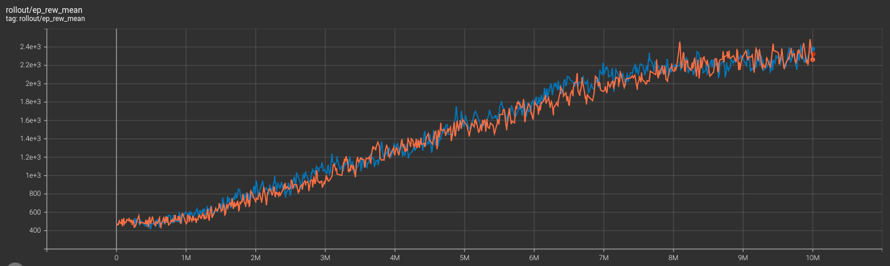

# Reinforcement Learning for MSPacman

This project is dedicated to training a Reinforcement Learning (RL) model to play the MSPacman game. Using a Deep Q-Network (DQN) architecture, the agent learns to navigate and score in the complex environment of the classic arcade game.




## Getting Started

To get started with this project, follow the steps below:


### Cloning the Repository

Clone this repository to your local machine using:

```sh
$ git clone <REPOSITORY_URL>
$ cd <REPOSITORY_DIRECTORY>
```


### Installing Dependencies

Install the necessary Python packages using:

```sh
$ pip install -r requirements.txt
```


### Training the Model

To train the model from scratch, run:

```sh
$ python trainer.py
```

The training script will use the architecture and hyperparameters specified in `dqn.py` and attempt to optimize the agent's performance in the MSPacman game.


### Watching the Agent Play

Once you have a trained model, you can watch it play live by running:

```sh
$ python enjoy.py
```

Make sure a trained model file is available for loading.


### Generating a GIF of the Agent

To create a GIF showcasing the agent's gameplay, execute:

```sh
$ python make_gif.py
```

This requires a trained model to be available for loading as well.


### Model Architecture and Hyperparameters

The model's architecture and hyperparameters are detailed in `dqn.py`. 
After 10 million training steps, the agent achieved a mean episode reward of 2400, as shown in the included tensorboard_training.png.




### Conclusion

This project demonstrates the power of Reinforcement Learning in creating agents that can learn complex behaviors in video game environments. By experimenting with different architectures and hyperparameters, one can further enhance the agent's performance and apply similar techniques to other gaming and non-gaming tasks.

Thank you for exploring this project. Feel free to clone, modify, and use the code for your own experiments and learning journey in the fascinating world of artificial intelligence and reinforcement learning.